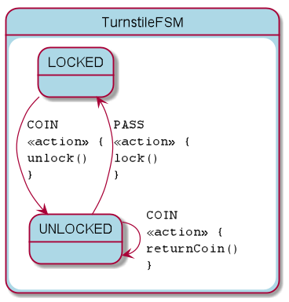

= KFSM Turnstile Sample for Spring MVC

A simple application to demonstrate implementing
link:https://github.com/open-jumpco/kfsm[KFSM] with the classic Turnstile FSM.

[source,bash]
----
./gradlew bootRun
----

Visit link:http://localhost:8080/[]

== Generated State Table

=== TurnstileFSM State Map

|===
| Start | Event[Guard] | Target | Action

| LOCKED
| COIN
| UNLOCKED
|  `{unlock()}`

| UNLOCKED
| PASS
| LOCKED
|  `{lock()}`

| UNLOCKED
| COIN
| UNLOCKED
|  `{returnCoin()}`
|===

== Generated State Diagram

To learn more about visualization visit link:https://github.com/open-jumpco/kfsm-viz[kfsm-viz] and
link:https://github.com/open-jumpco/kfsm-viz-plugin[kfsm-viz-plugin]

